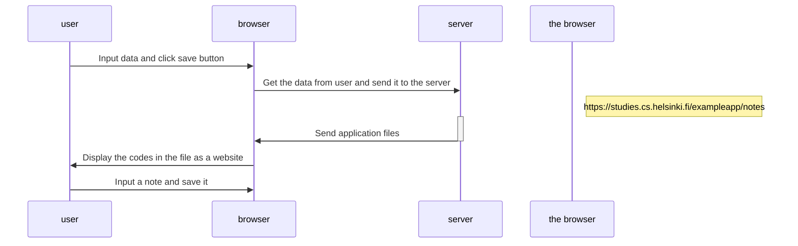

```mermaid

sequenceDiagram
  participant user
  participant browser
  participant server

  user->>browser: Input data and click save button

  browser->>server: Get the data from user and send it to the server
  note right of the browser: https://studies.cs.helsinki.fi/exampleapp/notes

  activate server
  server->>browser: Send application files
  deactivate server

  browser->>user: Display the codes in the file as a website

  user->>browser: Input a note and save it


```
